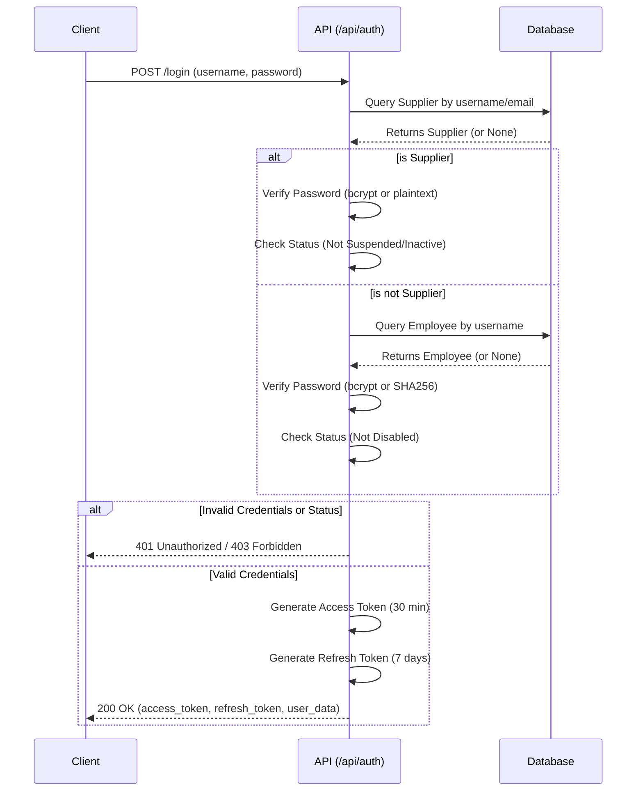
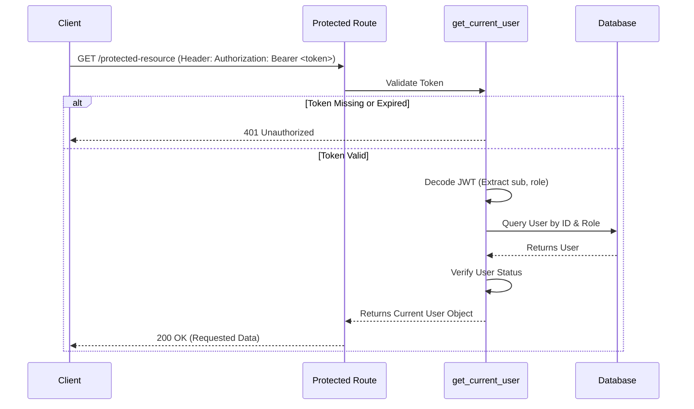

# Software Requirements Specification (SRS)
## Module: Authentication & Security

### 1. Introduction
#### 1.1 Purpose
The purpose of this document is to specify the software requirements for the Authentication and Security module of the system. This module is responsible for verifying user identities, managing sessions via tokens, and securing API endpoints.

#### 1.2 Scope
This module covers:
- User login (Suppliers and Employees).
- JWT-based session management (Access and Refresh tokens).
- Password hashing and legacy password support.
- Route protection and role-based access control.

### 2. Overall Description
#### 2.1 User Characteristics
The system interacts with two primary types of users:
1. **Suppliers**: External vendors interacting with the portal. They may have legacy accounts with plain-text passwords or modern accounts with bcrypt-hashed passwords.
2. **Employees**: Internal staff assigned to specific Zones and Woredas. They may have legacy accounts with SHA256-hashed passwords or modern accounts with bcrypt-hashed passwords.

#### 2.2 Operating Environment
- **Backend Framework**: FastAPI (Python 3.9+)
- **Security Standards**: JSON Web Tokens (JWT), Bcrypt password hashing.

### 3. Functional Requirements

#### 3.1 FR-1: Supplier Authentication
- **Description**: The system shall allow Suppliers to authenticate using either their `username` or `email` along with their `password`.
- **Business Rules**:
  - The system must verify the password against `bcrypt` hashes.
  - The system must support legacy plain-text passwords for backward compatibility.
  - If a supplier's account status is `Suspended` or `Inactive`, the login attempt must be rejected with a `403 Forbidden` error.

#### 3.2 FR-2: Employee Authentication
- **Description**: The system shall allow Employees to authenticate using their `username` and `password`.
- **Business Rules**:
  - The system must verify the password against `bcrypt` hashes.
  - The system must support legacy `SHA256` password hashes for backward compatibility.
  - If an employee's account status is `Disabled`, the login attempt must be rejected with a `403 Forbidden` error.
  - On successful login, the system shall record the employee's `last_activity` timestamp.

#### 3.3 FR-3: Token Generation & Session Management
- **Description**: Upon successful login, the system shall generate and return secure session tokens.
- **Business Rules**:
  - **Access Token**: An expiration time of 30 minutes. Encodes the user's ID and Role.
  - **Refresh Token**: An expiration time of 7 days. Used exclusively to generate new access tokens.
  - Tokens must be signed using the `HS256` algorithm.

#### 3.4 FR-4: Token Refresh
- **Description**: The system shall provide an endpoint (`/api/auth/refresh`) to issue new access tokens.
- **Business Rules**:
  - The endpoint must accept a valid, unexpired Refresh Token.
  - The token's payload type must be explicitly validated as `"refresh"`.

#### 3.5 FR-5: Route Protection
- **Description**: The system shall protect internal API routes by requiring a valid Access Token.
- **Business Rules**:
  - Incoming requests must include an `Authorization: Bearer <token>` header.
  - The system must validate the token signature and expiration.
  - The system must retrieve the user from the database and verify that their account has not been disabled/suspended since the token was issued.

### 4. Non-Functional Requirements

#### 4.1 Security Requirements
- **NFR-1**: All passwords must be hashed using `bcrypt` (except when validating existing legacy accounts).
- **NFR-2**: The JWT `SECRET_KEY` must be securely managed via environment variables and never hardcoded in production environments.
- **NFR-3**: User payload in JWT tokens must not contain sensitive information such as passwords.

#### 4.2 Performance Requirements
- **NFR-4**: Token validation and user lookup for protected routes must execute in under 50ms to prevent bottlenecking API requests.

### 5. Appendices
#### 5.1 Endpoint Specifications
| Endpoint | Method | Purpose | Input Payload | Response |
|----------|--------|---------|---------------|----------|
| `/api/auth/login` | POST | Authenticate user | `username`, `password` | `access_token`, `refresh_token`, user metadata |
| `/api/auth/refresh` | POST | Renew access token | `refresh_token` | `access_token` |

#### 5.2 UML Sequence Diagrams
##### 5.2.1 Authentication Flow

##### 5.2.2 Protected Route Access

