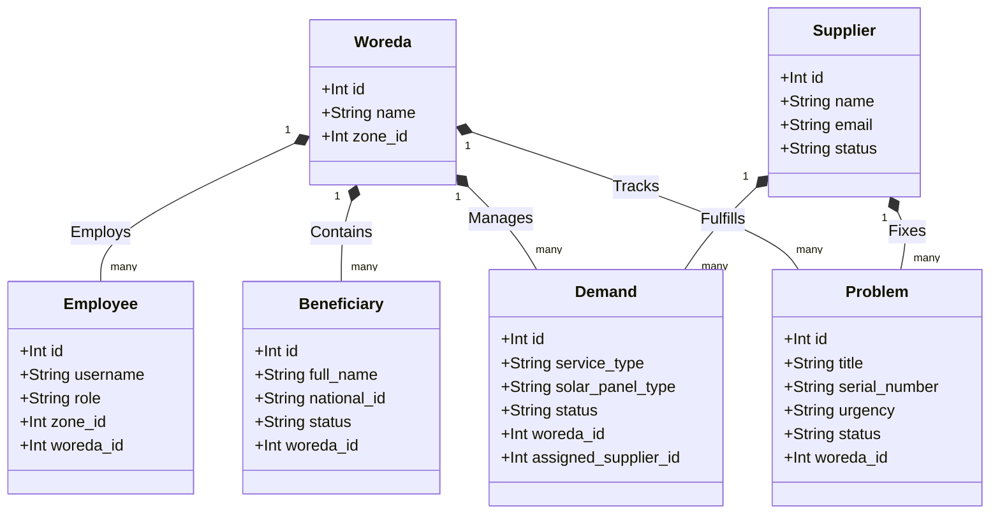
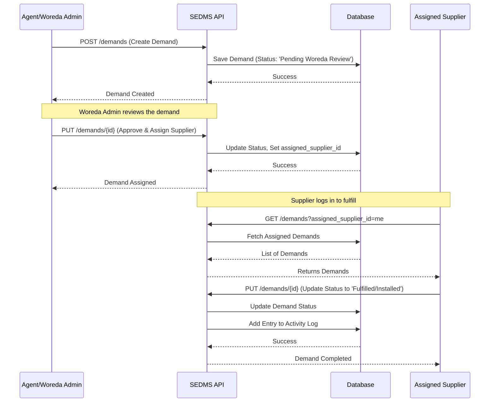

# Software Requirements Specification (SRS)
## Project: Solar Equipment Distribution & Management System (SEDMS)

### 1. Introduction
#### 1.1 Purpose
This document provides a comprehensive Software Requirements Specification (SRS) for the Solar Equipment Distribution & Management System. It defines the system's architecture, functional requirements, and behavioral flows for managing beneficiaries, tracking equipment demands, assigning suppliers, and resolving equipment faults across different geographical regions (Zones and Woredas).

#### 1.2 Scope
The system acts as a centralized portal for:
- Registering and surveying beneficiaries in off-grid or rural areas.
- Processing and approving demands for solar equipment.
- Assigning approved demands to registered Suppliers.
- Tracking and resolving equipment faults (Problems).
- Providing analytical dashboards for Regional, Zonal, and Woreda-level administrators.

### 2. Overall Description
#### 2.1 User Roles
- **System Admin / Regional Manager**: Full access to monitor operations, manage all employees, and view high-level dashboard metrics.
- **Zone Admin**: Manages Woredas within their assigned Zone, reviews aggregated data, and resolves escalated issues.
- **Woreda Admin**: Handles ground-level operations. Approves beneficiary registrations, reviews demands, and logs local problems.
- **Supplier**: Fulfills assigned equipment demands and updates the status of installations and repairs.
- **Agent/Contractor**: Ground staff acting on behalf of suppliers or woredas to conduct surveys and installations.

#### 2.2 Domain Entities
- **Beneficiaries**: End-users receiving the equipment.
- **Demands**: Requests for specific solar equipment/services, tied to a Woreda and eventually assigned to a Supplier.
- **Problems**: Fault tickets specifying the broken equipment, urgency, and the supplier responsible for the fix.
- **Geographic Areas**: Hierarchical mapping of Zones -> Woredas -> Kebeles -> Villages.

### 3. Functional Requirements

#### 3.1 Authentication & Authorization
- **FR-1.1**: The system must authenticate Suppliers and Employees using secure JWT (JSON Web Tokens).
- **FR-1.2**: Access to specific endpoints must be restricted based on the user's Role and their assigned Zone/Woreda.

#### 3.2 Beneficiary Management
- **FR-2.1**: The system shall allow authorized personnel to register new Beneficiaries, capturing their household size, gender, national ID, and location (Kebele/Village).
- **FR-2.2**: Beneficiary registrations must undergo a review process (e.g., 'Pending Woreda' status) before final approval.

#### 3.3 Demand Processing
- **FR-3.1**: Users shall be able to create Demands specifying the required `solar_panel_type`, `watt_level`, and `service_type`.
- **FR-3.2**: Woreda Admins must review and approve demands ('Pending Woreda Review').
- **FR-3.3**: Approved demands must be assignable to a specific registered `Supplier`.

#### 3.4 Problem / Fault Management
- **FR-4.1**: Users shall be able to log a `Problem` ticket if equipment fails, detailing the `serial_number`, `urgency`, and `days_unfunctional`.
- **FR-4.2**: Problem tickets must track the lifecycle from 'Open' to 'Resolved', including tracking the `occurred_date` and `fixed_date`.

#### 3.5 Dashboards & Reporting
- **FR-5.1**: The system must provide aggregated statistics (Dashboard Stats) tailored to the user's geographic assignment.
- **FR-5.2**: The system must log major activities (Activity Logs) for auditing purposes.

### 4. Non-Functional Requirements
- **Performance**: API responses must return in under 200ms.
- **Security**: Passwords must be hashed via `bcrypt`. Endpoints must be protected against SQL injection via the SQLAlchemy ORM.
- **Scalability**: The database design must efficiently query geographically partitioned data.

---

### 5. UML Diagrams

#### 5.1 System Use Case Diagram
This diagram outlines the primary interactions between the actors and the system.

```mermaid
usecaseDiagram
    actor Woreda_Admin as "Woreda Admin"
    actor Supplier
    actor Zone_Admin as "Zone/Regional Admin"

    package "SEDMS Platform" {
        usecase UC1 as "Register Beneficiary"
        usecase UC2 as "Review & Approve Demands"
        usecase UC3 as "Report Equipment Problem"
        usecase UC4 as "Fulfill Demand"
        usecase UC5 as "Update Problem Status"
        usecase UC6 as "View Regional Dashboards"
    }

    Woreda_Admin --> UC1
    Woreda_Admin --> UC2
    Woreda_Admin --> UC3
    
    Supplier --> UC4
    Supplier --> UC5
    
    Zone_Admin --> UC6
    Zone_Admin --> UC2
```

#### 5.2 Domain Entity Relationship (ER) / Class Diagram
Illustrates the core database models and their relationships.



#### 5.3 Demand Lifecycle Sequence Diagram
Visualizes the process of a Demand being created, approved, and fulfilled.


